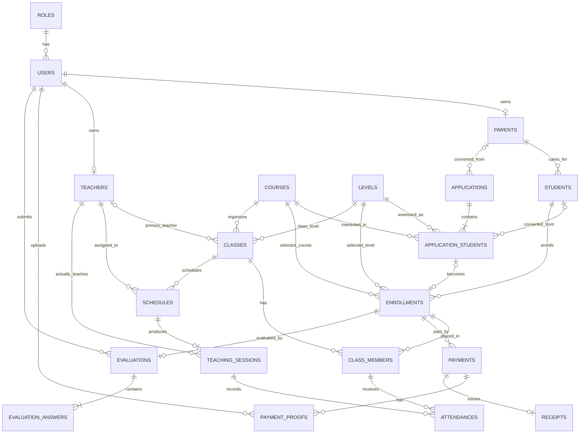

# Database Design & Data Dictionary

เอกสารออกแบบฐานข้อมูลระบบสมัครเรียนโรงเรียนสอนภาษาอังกฤษ  
ฐานข้อมูล: `anna_english_school`  
Database Engine: MariaDB/MySQL (`InnoDB`)  
Charset/Collation: `utf8mb4` / `utf8mb4_unicode_ci`

> เอกสารนี้เป็นแหล่งอ้างอิงแบบฐานข้อมูลที่ตกลงกันใน Phase 2 ไม่ใช่ไฟล์ SQL และไม่สร้างตารางให้อัตโนมัติ ทุกตารางต้องสร้างและทดสอบทีละส่วนตาม `TASKS.md`

## 1. สถานะปัจจุบัน

- สร้างจริงแล้ว: `roles`, `users`
- ออกแบบแล้วแต่ยังไม่ได้สร้าง: ตารางที่เหลือในเอกสารนี้
- ข้อมูลธุรกิจที่ยังไม่ได้รับจากลูกค้า เช่น ชื่อคอร์สจริง ราคา ชั่วโมง โปรโมชั่น และช่วงอายุสุดท้าย ต้องใช้สถานะ `TBD` ห้ามสมมติเป็นข้อมูลจริง
- `users` ใช้ `username` สำหรับ Login ไม่ใช้ Email
- Database เก็บ `password_hash` เท่านั้น ห้ามเก็บ Password แบบ Plain Text
- ไม่มีคอลัมน์ `must_change_password` ตามข้อตกลง

## 2. มาตรฐานร่วม

| หัวข้อ | มาตรฐาน |
|---|---|
| ชื่อตาราง | ภาษาอังกฤษ พหูพจน์ และ `snake_case` เช่น `teaching_sessions` |
| ชื่อคอลัมน์ | ภาษาอังกฤษและ `snake_case` เช่น `birth_date` |
| Primary Key | `id INT UNSIGNED AUTO_INCREMENT` |
| Foreign Key | ลงท้ายด้วย `_id` และใช้ชนิดเดียวกับ Primary Key |
| ข้อความทั่วไป | `VARCHAR` ตามขนาดที่เหมาะสม |
| ข้อความยาว | `TEXT` |
| เงิน | `DECIMAL(10,2)` ห้ามใช้ `FLOAT` |
| ระยะเวลา | เก็บเป็นนาทีด้วย `INT UNSIGNED` |
| วัน | `DATE` |
| เวลา | `TIME` |
| วันและเวลา | `DATETIME` หรือ `TIMESTAMP` |
| ค่าจริง/เท็จ | `BOOLEAN` ซึ่ง MariaDB เก็บภายในเป็น `TINYINT(1)` |
| สถานะ | `VARCHAR(30)` และกำหนดค่าที่อนุญาตใน Backend |
| วันที่สร้าง/แก้ไข | `created_at`, `updated_at` |
| การลบข้อมูลหลัก | ควรปิดใช้งานด้วยสถานะก่อน หลีกเลี่ยง Hard Delete |

คำย่อ:

- **PK — Primary Key (กุญแจหลัก):** รหัสที่ไม่ซ้ำ ใช้ระบุหนึ่งแถว
- **FK — Foreign Key (กุญแจต่างประเทศ):** คอลัมน์ที่เชื่อมไปยัง PK ของอีกตาราง
- **UQ — Unique (ห้ามซ้ำ):** ค่าในคอลัมน์หรือชุดคอลัมน์ต้องไม่ซ้ำ
- **NN — Not Null (ห้ามว่าง):** ต้องมีค่า
- **NULL:** ยังไม่มีค่าได้

## 3. สรุปตารางทั้งหมด

แบบปัจจุบันมี **20 ตาราง รวม 205 คอลัมน์ตามแผน**

| # | Table | ความหมายภาษาไทย | จำนวนคอลัมน์ | หน้าที่ | สถานะ |
|---:|---|---|---:|---|---|
| 1 | `roles` | บทบาทผู้ใช้ | 4 | เก็บ ADMIN, PARENT, TEACHER | สร้างแล้ว |
| 2 | `users` | บัญชีผู้ใช้ | 7 | เก็บ Username, Password Hash และสถานะบัญชี | สร้างแล้ว |
| 3 | `parents` | ผู้ปกครอง | 15 | เก็บข้อมูลส่วนตัว ข้อมูลติดต่อ และสถานะอนุมัติผู้ปกครอง | สร้างแล้ว |
| 4 | `students` | นักเรียน | 11 | เก็บข้อมูลนักเรียนซึ่งอยู่ในความดูแลของผู้ปกครอง | สร้างแล้ว |
| 5 | `teachers` | ครู | 10 | เก็บโปรไฟล์ครูและเชื่อมบัญชี Login | สร้างแล้ว |
| 6 | `courses` | คอร์ส | 12 | เก็บข้อมูลแม่แบบคอร์ส ราคา และเวลารวม | สร้างแล้ว |
| 7 | `levels` | ระดับ | 7 | เก็บระดับความสามารถ แยกจากอายุและคอร์ส | สร้างแล้ว |
| 8 | `applications` | ใบสมัคร | 13 | เก็บข้อมูลผู้ปกครองที่กรอกใบสมัครก่อนมีบัญชี | สร้างแล้ว |
| 9 | `application_students` | นักเรียนในใบสมัคร | 15 | รองรับนักเรียนหลายคนในใบสมัครเดียว | สร้างแล้ว |
| 10 | `enrollments` | การลงทะเบียนเรียน | 13 | ยืนยันนักเรียน คอร์ส ระดับ เวลา และราคาที่ซื้อ | สร้างแล้ว |
| 11 | `classes` | คลาสเรียน | 11 | เก็บกลุ่มเรียนจริงของคอร์สและระดับ | สร้างแล้ว |
| 12 | `class_members` | สมาชิกคลาส | 8 | เชื่อม Enrollment เข้ากับ Class | สร้างแล้ว |
| 13 | `schedules` | ตารางเรียนรายครั้ง | 11 | เก็บวันและเวลาที่วางแผนสอนแต่ละครั้ง | สร้างแล้ว |
| 14 | `teaching_sessions` | บันทึกการสอนจริง | 13 | เก็บเวลาสอนจริง เนื้อหา และความก้าวหน้า | รอสร้าง |
| 15 | `attendances` | การเข้าเรียน | 7 | เก็บสถานะเข้าเรียนของสมาชิกแต่ละคนต่อครั้ง | รอสร้าง |
| 16 | `payments` | การชำระเงิน | 12 | เก็บยอด วิธีชำระ และสถานะตรวจสอบ | รอสร้าง |
| 17 | `payment_proofs` | หลักฐานการชำระเงิน | 12 | เก็บ Metadata ของสลิปและผลตรวจ | รอสร้าง |
| 18 | `receipts` | ใบเสร็จ | 9 | เก็บเลขและไฟล์ใบเสร็จของ Payment ที่ชำระแล้ว | รอสร้าง |
| 19 | `evaluations` | แบบประเมิน | 8 | เก็บหัวแบบประเมินหลังจบคอร์ส | รอสร้าง |
| 20 | `evaluation_answers` | คำตอบแบบประเมิน | 7 | เก็บคะแนน/ความเห็นแยกตามหัวข้อ | รอสร้าง |

## 4. ภาพรวมความสัมพันธ์



Cardinality ที่สำคัญ:

- Role 1 รายการมี User ได้หลายบัญชี แต่ User 1 บัญชีมี Role เดียว
- User แบบ Parent มี Parent Profile ได้ไม่เกิน 1 รายการ
- User แบบ Teacher มี Teacher Profile ได้ไม่เกิน 1 รายการ
- Parent 1 คนมี Student ได้หลายคน แต่ Student 1 คนผูกกับ Parent ได้เพียงคนเดียว
- Application 1 ใบมี Application Student ได้หลายคน
- Student 1 คนมี Enrollment ได้หลายรายการ จึงเรียนหลายคอร์สได้
- Class และ Enrollment เป็น Many-to-Many ผ่าน `class_members`
- Schedule 1 รายการมี Teaching Session ได้ 0 หรือ 1 รายการ
- Teaching Session 1 รายการมี Attendance หลายรายการ
- Enrollment 1 รายการมี Payment ได้หลายรายการ เพื่อรองรับการแบ่งชำระในอนาคต
- Payment 1 รายการมีหลักฐานได้หลายไฟล์ และมี Receipt ได้ไม่เกิน 1 ใบ
- Enrollment 1 รายการมี Evaluation ได้ไม่เกิน 1 ชุดตามกติกาปัจจุบัน

## 5. Data Dictionary รายตาราง

### 5.1 `roles` — บทบาทผู้ใช้

เก็บชื่อบทบาทสำหรับ Role-based Access Control ได้แก่ `ADMIN`, `PARENT`, `TEACHER`

| Column | Type | Null | Key/Constraint | ความหมาย |
|---|---|---|---|---|
| `id` | `INT UNSIGNED` | ไม่ | PK, Auto Increment | รหัสบทบาท |
| `name` | `VARCHAR(50)` | ไม่ | UQ | ชื่อบทบาท เช่น `ADMIN` |
| `created_at` | `TIMESTAMP` | ไม่ | Default Current Timestamp | วันที่สร้าง |
| `updated_at` | `TIMESTAMP` | ไม่ | Auto Update | วันที่แก้ไขล่าสุด |

ความสัมพันธ์: `roles.id` ถูกอ้างโดย `users.role_id` แบบ One-to-Many

### 5.2 `users` — บัญชีผู้ใช้

เก็บข้อมูลสำหรับ Login เท่านั้น ข้อมูลโปรไฟล์จริงแยกไว้ใน `parents` หรือ `teachers`

| Column | Type | Null | Key/Constraint | ความหมาย |
|---|---|---|---|---|
| `id` | `INT UNSIGNED` | ไม่ | PK, Auto Increment | รหัสบัญชี |
| `role_id` | `INT UNSIGNED` | ไม่ | FK → `roles.id` | บทบาทของบัญชี |
| `username` | `VARCHAR(50)` | ไม่ | UQ | Username สำหรับ Login |
| `password_hash` | `VARCHAR(255)` | ไม่ | — | Password ที่ Hash แล้ว ห้ามแสดงต่อผู้ใช้ |
| `is_active` | `BOOLEAN` | ไม่ | Default `FALSE` | บัญชีได้รับอนุญาตให้ Login หรือไม่ |
| `created_at` | `TIMESTAMP` | ไม่ | Default Current Timestamp | วันที่สร้างบัญชี |
| `updated_at` | `TIMESTAMP` | ไม่ | Auto Update | วันที่แก้ไขบัญชีล่าสุด |

ข้อกำหนด:

- ไม่ใช้ Email เป็น Login
- ไม่เก็บ Password จริง
- ไม่มี `must_change_password`
- Parent ที่สมัครเองเริ่ม `is_active = FALSE`; Admin อนุมัติแล้วจึงเป็น `TRUE`
- Admin สร้างบัญชี Teacher/Parent ให้สามารถกำหนด `is_active = TRUE` ตาม Flow ที่ได้รับอนุญาต
- `ON DELETE RESTRICT` สำหรับ Role เพื่อป้องกันการลบบทบาทที่ยังมี User

### 5.3 `parents` — ผู้ปกครอง

เก็บโปรไฟล์และช่องทางติดต่อของผู้ปกครอง แยกจากข้อมูล Login

| Column | Type | Null | Key/Constraint | ความหมาย |
|---|---|---|---|---|
| `id` | `INT UNSIGNED` | ไม่ | PK, Auto Increment | รหัสผู้ปกครอง |
| `user_id` | `INT UNSIGNED` | ไม่ | FK → `users.id`, UQ | บัญชี Login ของผู้ปกครอง |
| `title` | `VARCHAR(30)` | ได้ | — | คำนำหน้าชื่อ |
| `first_name` | `VARCHAR(100)` | ไม่ | — | ชื่อ |
| `last_name` | `VARCHAR(100)` | ไม่ | — | นามสกุล |
| `phone` | `VARCHAR(30)` | ไม่ | Index | เบอร์โทรศัพท์ เก็บเป็นข้อความเพื่อรักษาเลข 0 หน้า |
| `email` | `VARCHAR(255)` | ได้ | — | Email สำหรับติดต่อ ไม่ใช่ Username |
| `line_id` | `VARCHAR(100)` | ได้ | — | LINE ID หรือช่องทางติดต่อเพิ่มเติม |
| `address` | `TEXT` | ได้ | — | ที่อยู่ |
| `approval_status` | `VARCHAR(20)` | ไม่ | Default `PENDING`, Index, Check | สถานะ `PENDING`, `APPROVED` หรือ `REJECTED` |
| `reviewed_at` | `DATETIME` | ได้ | — | วันที่และเวลาที่ Admin ตรวจคำขอ |
| `reviewed_by_user_id` | `INT UNSIGNED` | ได้ | FK → `users.id`, Index | บัญชี Admin ที่ตรวจคำขอ |
| `rejection_reason` | `TEXT` | ได้ | — | เหตุผลที่ปฏิเสธคำขอลงทะเบียน |
| `created_at` | `TIMESTAMP` | ไม่ | Default Current Timestamp | วันที่สร้างข้อมูล |
| `updated_at` | `TIMESTAMP` | ไม่ | Auto Update | วันที่แก้ไขล่าสุด |

ความสัมพันธ์:

- User 1 บัญชีมี Parent Profile ได้ 0 หรือ 1 รายการ ด้วย `UNIQUE(user_id)`
- Parent 1 คนมี Student ได้หลายคน
- Admin User 1 บัญชีตรวจคำขอ Parent ได้หลายรายการผ่าน `reviewed_by_user_id`
- `approval_status` แยกสถานะรออนุมัติ/อนุมัติ/ปฏิเสธออกจาก `users.is_active` ซึ่งใช้ควบคุมการ Login

### 5.4 `students` — นักเรียน

เก็บข้อมูลนักเรียน นักเรียนไม่มีบัญชี Login และต้องผูกกับ Parent เพียงคนเดียว

| Column | Type | Null | Key/Constraint | ความหมาย |
|---|---|---|---|---|
| `id` | `INT UNSIGNED` | ไม่ | PK, Auto Increment | รหัสนักเรียน |
| `parent_id` | `INT UNSIGNED` | ไม่ | FK → `parents.id`, Index | ผู้ปกครองเจ้าของข้อมูล |
| `title` | `VARCHAR(30)` | ได้ | — | คำนำหน้าชื่อ |
| `first_name` | `VARCHAR(100)` | ไม่ | — | ชื่อ |
| `last_name` | `VARCHAR(100)` | ไม่ | — | นามสกุล |
| `nickname` | `VARCHAR(100)` | ได้ | — | ชื่อเล่น |
| `birth_date` | `DATE` | ไม่ | — | วันเกิด ใช้คำนวณอายุ |
| `school_name` | `VARCHAR(255)` | ได้ | — | โรงเรียนที่กำลังศึกษา |
| `medical_condition` | `TEXT` | ได้ | — | โรคประจำตัว/ข้อมูลสุขภาพที่จำเป็นต่อการดูแล |
| `created_at` | `TIMESTAMP` | ไม่ | Default Current Timestamp | วันที่สร้างข้อมูล |
| `updated_at` | `TIMESTAMP` | ไม่ | Auto Update | วันที่แก้ไขล่าสุด |

ข้อกำหนด:

- เก็บ `birth_date` ไม่เก็บ `age` เพราะอายุเปลี่ยนตามเวลา
- Parent 1 คนมีนักเรียนหลายคนได้ แต่ Student 1 คนมี Parent Account เดียว
- ข้อมูลสุขภาพเป็นข้อมูลละเอียดอ่อน Backend ต้องจำกัดสิทธิ์

### 5.5 `teachers` — ครู

เก็บโปรไฟล์ครู โดย Admin เป็นผู้สร้างบัญชีและเปิด/ปิดผ่าน `users.is_active`

| Column | Type | Null | Key/Constraint | ความหมาย |
|---|---|---|---|---|
| `id` | `INT UNSIGNED` | ไม่ | PK, Auto Increment | รหัสครู |
| `user_id` | `INT UNSIGNED` | ไม่ | FK → `users.id`, UQ | บัญชี Login ของครู |
| `title` | `VARCHAR(30)` | ได้ | — | คำนำหน้าชื่อ |
| `first_name` | `VARCHAR(100)` | ไม่ | — | ชื่อ |
| `last_name` | `VARCHAR(100)` | ไม่ | — | นามสกุล |
| `phone` | `VARCHAR(30)` | ได้ | — | เบอร์โทรศัพท์ |
| `email` | `VARCHAR(255)` | ได้ | — | Email สำหรับติดต่อ |
| `biography` | `TEXT` | ได้ | — | ประวัติหรือข้อมูลแนะนำครู |
| `created_at` | `TIMESTAMP` | ไม่ | Default Current Timestamp | วันที่สร้างข้อมูล |
| `updated_at` | `TIMESTAMP` | ไม่ | Auto Update | วันที่แก้ไขล่าสุด |

ความสัมพันธ์: Teacher 1 คนดูแลหลาย Class/Schedule/Teaching Session ได้

### 5.6 `courses` — คอร์ส

เก็บแม่แบบคอร์สที่แสดงบน Public Website และใช้เป็นต้นทางของ Enrollment

| Column | Type | Null | Key/Constraint | ความหมาย |
|---|---|---|---|---|
| `id` | `INT UNSIGNED` | ไม่ | PK, Auto Increment | รหัสคอร์ส |
| `name` | `VARCHAR(150)` | ไม่ | UQ | ชื่อคอร์ส |
| `description` | `TEXT` | ได้ | — | รายละเอียดคอร์ส |
| `recommended_min_age` | `TINYINT UNSIGNED` | ได้ | — | อายุขั้นต่ำที่แนะนำ ไม่ใช่ข้อบังคับ |
| `recommended_max_age` | `TINYINT UNSIGNED` | ได้ | — | อายุสูงสุดที่แนะนำ ไม่ใช่ข้อบังคับ |
| `price` | `DECIMAL(10,2)` | ไม่ | — | ราคาปัจจุบันของคอร์ส |
| `total_minutes` | `INT UNSIGNED` | ไม่ | มากกว่า 0 | เวลารวมของคอร์สเป็นนาที |
| `promotion_text` | `TEXT` | ได้ | — | ข้อความโปรโมชั่น |
| `image_path` | `VARCHAR(500)` | ได้ | — | Path/URL รูปภาพ ไม่เก็บไฟล์ Binary ในตาราง |
| `is_open` | `BOOLEAN` | ไม่ | Default `TRUE` | เปิดหรือปิดรับสมัคร |
| `created_at` | `TIMESTAMP` | ไม่ | Default Current Timestamp | วันที่สร้าง |
| `updated_at` | `TIMESTAMP` | ไม่ | Auto Update | วันที่แก้ไขล่าสุด |

ข้อกำหนดเวลา:

- ห้ามใช้ `total_hours` แบบทศนิยม
- ตัวอย่าง 90 นาทีให้ Frontend แสดงเป็น “1 ชั่วโมง 30 นาที”
- ชื่อ ราคา ชั่วโมง โปรโมชั่น และช่วงอายุจริงยังเป็น `TBD` จนกว่าลูกค้ายืนยัน

### 5.7 `levels` — ระดับ

เก็บระดับความสามารถ แยกจากช่วงอายุและ Course

| Column | Type | Null | Key/Constraint | ความหมาย |
|---|---|---|---|---|
| `id` | `INT UNSIGNED` | ไม่ | PK, Auto Increment | รหัสระดับ |
| `name` | `VARCHAR(100)` | ไม่ | UQ | ชื่อระดับ เช่น Beginner |
| `description` | `TEXT` | ได้ | — | คำอธิบายระดับ |
| `sort_order` | `INT UNSIGNED` | ไม่ | Default `0` | ลำดับการแสดงผล |
| `is_active` | `BOOLEAN` | ไม่ | Default `TRUE` | เปิดใช้งานระดับหรือไม่ |
| `created_at` | `TIMESTAMP` | ไม่ | Default Current Timestamp | วันที่สร้าง |
| `updated_at` | `TIMESTAMP` | ไม่ | Auto Update | วันที่แก้ไขล่าสุด |

ตัวอย่าง Level เป็นเพียงแนวคิด: Beginner, Intermediate, Advanced

### 5.8 `applications` — ใบสมัครเรียน

เก็บข้อมูลผู้ปกครองจาก Public Form ก่อนมีบัญชีจริง หนึ่งใบสมัครมีนักเรียนได้หลายคน

| Column | Type | Null | Key/Constraint | ความหมาย |
|---|---|---|---|---|
| `id` | `INT UNSIGNED` | ไม่ | PK, Auto Increment | รหัสใบสมัคร |
| `parent_id` | `INT UNSIGNED` | ได้ | FK → `parents.id` | Parent ที่สร้างภายหลังการอนุมัติ |
| `parent_title` | `VARCHAR(30)` | ได้ | — | คำนำหน้าผู้ปกครอง ณ เวลาสมัคร |
| `parent_first_name` | `VARCHAR(100)` | ไม่ | — | ชื่อผู้ปกครอง ณ เวลาสมัคร |
| `parent_last_name` | `VARCHAR(100)` | ไม่ | — | นามสกุลผู้ปกครอง ณ เวลาสมัคร |
| `parent_phone` | `VARCHAR(30)` | ไม่ | Index | เบอร์โทรสำหรับติดต่อกลับ |
| `parent_email` | `VARCHAR(255)` | ได้ | — | Email ติดต่อ |
| `parent_line_id` | `VARCHAR(100)` | ได้ | — | LINE ID/ช่องทางติดต่อเพิ่มเติม |
| `parent_address` | `TEXT` | ได้ | — | ที่อยู่ที่กรอกตอนสมัคร |
| `status` | `VARCHAR(30)` | ไม่ | Default `NEW`, Index | สถานะใบสมัคร |
| `admin_note` | `TEXT` | ได้ | — | หมายเหตุจากการติดต่อ/ตรวจสอบ |
| `created_at` | `TIMESTAMP` | ไม่ | Default Current Timestamp | วันที่ส่งใบสมัคร |
| `updated_at` | `TIMESTAMP` | ไม่ | Auto Update | วันที่แก้ไขล่าสุด |

สถานะที่วางไว้: `NEW`, `CONTACTED`, `ASSESSED`, `APPROVED`, `REJECTED`

ข้อมูลในใบสมัครเป็น Snapshot เพื่อเก็บสิ่งที่ผู้สมัครกรอกในเวลานั้น ไม่ใช่ข้อมูล Parent Profile โดยตรง

### 5.9 `application_students` — นักเรียนในใบสมัคร

แยกจาก `applications` เพื่อให้หนึ่งผู้ปกครองเพิ่มนักเรียนหลายคนในใบสมัครเดียวได้

| Column | Type | Null | Key/Constraint | ความหมาย |
|---|---|---|---|---|
| `id` | `INT UNSIGNED` | ไม่ | PK, Auto Increment | รหัสนักเรียนในใบสมัคร |
| `application_id` | `INT UNSIGNED` | ไม่ | FK → `applications.id`, Index | ใบสมัครเจ้าของรายการ |
| `student_id` | `INT UNSIGNED` | ได้ | FK → `students.id`, UQ | Student ที่สร้างหลังอนุมัติ |
| `title` | `VARCHAR(30)` | ได้ | — | คำนำหน้าชื่อนักเรียน |
| `first_name` | `VARCHAR(100)` | ไม่ | — | ชื่อ |
| `last_name` | `VARCHAR(100)` | ไม่ | — | นามสกุล |
| `nickname` | `VARCHAR(100)` | ได้ | — | ชื่อเล่น |
| `birth_date` | `DATE` | ไม่ | — | วันเกิด |
| `school_name` | `VARCHAR(255)` | ได้ | — | โรงเรียนที่กำลังศึกษา |
| `medical_condition` | `TEXT` | ได้ | — | โรคประจำตัว/ข้อมูลสุขภาพ |
| `interested_course_id` | `INT UNSIGNED` | ได้ | FK → `courses.id` | คอร์สที่สนใจตอนสมัคร |
| `assessed_level_id` | `INT UNSIGNED` | ได้ | FK → `levels.id` | ระดับที่โรงเรียนประเมินภายหลัง |
| `assessment_note` | `TEXT` | ได้ | — | หมายเหตุจากการประเมิน |
| `created_at` | `TIMESTAMP` | ไม่ | Default Current Timestamp | วันที่เพิ่มรายการ |
| `updated_at` | `TIMESTAMP` | ไม่ | Auto Update | วันที่แก้ไขล่าสุด |

คอร์สที่สนใจไม่ใช่คอร์สสุดท้าย คอร์ส/ระดับที่ยืนยันจริงอยู่ใน `enrollments`

### 5.10 `enrollments` — การลงทะเบียนเรียน

เก็บการยืนยันว่า Student ลงเรียน Course/Level ใด และถือสิทธิ์เวลาเรียนเท่าใด

| Column | Type | Null | Key/Constraint | ความหมาย |
|---|---|---|---|---|
| `id` | `INT UNSIGNED` | ไม่ | PK, Auto Increment | รหัสการลงทะเบียน |
| `student_id` | `INT UNSIGNED` | ไม่ | FK → `students.id`, Index | นักเรียน |
| `course_id` | `INT UNSIGNED` | ไม่ | FK → `courses.id`, Index | คอร์สที่ยืนยันจริง |
| `level_id` | `INT UNSIGNED` | ไม่ | FK → `levels.id`, Index | ระดับที่ยืนยันจริง |
| `application_student_id` | `INT UNSIGNED` | ได้ | FK → `application_students.id`, UQ | ต้นทางจากใบสมัคร ถ้ามี |
| `allocated_minutes` | `INT UNSIGNED` | ไม่ | มากกว่า 0 | จำนวนนาทีที่ซื้อ/ได้รับตอนลงทะเบียน |
| `price_at_enrollment` | `DECIMAL(10,2)` | ไม่ | — | ราคาที่ตกลง ณ เวลาลงทะเบียน |
| `status` | `VARCHAR(30)` | ไม่ | Default `PENDING`, Index | สถานะการลงทะเบียน |
| `enrolled_at` | `DATETIME` | ไม่ | Default Current Timestamp | เวลายืนยันการลงทะเบียน |
| `start_date` | `DATE` | ได้ | — | วันที่เริ่มเรียน |
| `end_date` | `DATE` | ได้ | — | วันที่จบ/หมดอายุ |
| `created_at` | `TIMESTAMP` | ไม่ | Default Current Timestamp | วันที่สร้าง |
| `updated_at` | `TIMESTAMP` | ไม่ | Auto Update | วันที่แก้ไขล่าสุด |

สถานะที่วางไว้: `PENDING`, `ACTIVE`, `COMPLETED`, `CANCELLED`

`allocated_minutes` และ `price_at_enrollment` เป็น Snapshot ที่ตั้งใจเก็บ เพราะ Course อาจเปลี่ยนเวลา/ราคาในอนาคต

### 5.11 `classes` — คลาสเรียน

เก็บกลุ่มเรียนจริง แยกจาก Course ซึ่งเป็นแม่แบบสินค้า

| Column | Type | Null | Key/Constraint | ความหมาย |
|---|---|---|---|---|
| `id` | `INT UNSIGNED` | ไม่ | PK, Auto Increment | รหัสคลาส |
| `course_id` | `INT UNSIGNED` | ไม่ | FK → `courses.id`, Index | คอร์สของคลาส |
| `level_id` | `INT UNSIGNED` | ไม่ | FK → `levels.id`, Index | ระดับของคลาส |
| `primary_teacher_id` | `INT UNSIGNED` | ได้ | FK → `teachers.id` | ครูหลักของคลาส |
| `class_code` | `VARCHAR(50)` | ไม่ | UQ | รหัสคลาสสำหรับอ้างอิง |
| `class_name` | `VARCHAR(150)` | ไม่ | — | ชื่อคลาสที่แสดงผล |
| `status` | `VARCHAR(30)` | ไม่ | Default `PLANNED`, Index | สถานะคลาส |
| `start_date` | `DATE` | ได้ | — | วันที่เริ่มคลาส |
| `end_date` | `DATE` | ได้ | — | วันที่สิ้นสุดคลาส |
| `created_at` | `TIMESTAMP` | ไม่ | Default Current Timestamp | วันที่สร้าง |
| `updated_at` | `TIMESTAMP` | ไม่ | Auto Update | วันที่แก้ไขล่าสุด |

สถานะที่วางไว้: `PLANNED`, `ACTIVE`, `COMPLETED`, `CANCELLED`

### 5.12 `class_members` — สมาชิกคลาส

เป็น Junction Table (ตารางเชื่อม) ระหว่าง Class กับ Enrollment เพื่อระบุว่าสิทธิ์เรียนรายการใดถูกจัดเข้าคลาสใด

| Column | Type | Null | Key/Constraint | ความหมาย |
|---|---|---|---|---|
| `id` | `INT UNSIGNED` | ไม่ | PK, Auto Increment | รหัสสมาชิกคลาส |
| `class_id` | `INT UNSIGNED` | ไม่ | FK → `classes.id` | คลาส |
| `enrollment_id` | `INT UNSIGNED` | ไม่ | FK → `enrollments.id` | การลงทะเบียนของนักเรียน |
| `status` | `VARCHAR(30)` | ไม่ | Default `ACTIVE` | สถานะสมาชิกในคลาส |
| `joined_at` | `DATETIME` | ไม่ | Default Current Timestamp | วันที่เข้าคลาส |
| `left_at` | `DATETIME` | ได้ | — | วันที่ออกจากคลาส |
| `created_at` | `TIMESTAMP` | ไม่ | Default Current Timestamp | วันที่สร้าง |
| `updated_at` | `TIMESTAMP` | ไม่ | Auto Update | วันที่แก้ไขล่าสุด |

Constraint สำคัญ: `UNIQUE(class_id, enrollment_id)` ป้องกันเพิ่ม Enrollment เดิมเข้าคลาสเดิมซ้ำ

Student อ่านผ่าน `class_members → enrollments → students` จึงไม่เก็บ `student_id` ซ้ำในตารางนี้

### 5.13 `schedules` — ตารางเรียนรายครั้ง

เก็บแผนวันและเวลาสอนแต่ละครั้ง ไม่บังคับเป็นตารางประจำ

| Column | Type | Null | Key/Constraint | ความหมาย |
|---|---|---|---|---|
| `id` | `INT UNSIGNED` | ไม่ | PK, Auto Increment | รหัสตารางเรียน |
| `class_id` | `INT UNSIGNED` | ไม่ | FK → `classes.id`, Index | คลาสที่จะเรียน |
| `teacher_id` | `INT UNSIGNED` | ไม่ | FK → `teachers.id`, Index | ครูที่วางแผนให้สอน |
| `scheduled_date` | `DATE` | ไม่ | Index | วันที่วางแผนเรียน |
| `start_time` | `TIME` | ไม่ | — | เวลาเริ่มตามแผน |
| `end_time` | `TIME` | ไม่ | — | เวลาสิ้นสุดตามแผน |
| `status` | `VARCHAR(30)` | ไม่ | Default `SCHEDULED` | สถานะตาราง |
| `location` | `VARCHAR(255)` | ได้ | — | ห้องเรียน/สถานที่/ช่องทางออนไลน์ |
| `note` | `TEXT` | ได้ | — | หมายเหตุตาราง |
| `created_at` | `TIMESTAMP` | ไม่ | Default Current Timestamp | วันที่สร้าง |
| `updated_at` | `TIMESTAMP` | ไม่ | Auto Update | วันที่แก้ไขล่าสุด |

สถานะที่วางไว้: `SCHEDULED`, `RESCHEDULED`, `COMPLETED`, `CANCELLED`

### 5.14 `teaching_sessions` — บันทึกการสอนจริง

สร้างเมื่อมีการสอนจริงจาก Schedule และใช้ `actual_minutes` เป็นแหล่งข้อมูลหักเวลา

| Column | Type | Null | Key/Constraint | ความหมาย |
|---|---|---|---|---|
| `id` | `INT UNSIGNED` | ไม่ | PK, Auto Increment | รหัสบันทึกการสอน |
| `schedule_id` | `INT UNSIGNED` | ไม่ | FK → `schedules.id`, UQ | ตารางเรียนต้นทาง |
| `teacher_id` | `INT UNSIGNED` | ไม่ | FK → `teachers.id`, Index | ครูที่สอนจริง รองรับครูสอนแทน |
| `started_at` | `DATETIME` | ไม่ | — | วันเวลาเริ่มสอนจริง |
| `ended_at` | `DATETIME` | ไม่ | — | วันเวลาสิ้นสุดจริง |
| `actual_minutes` | `INT UNSIGNED` | ไม่ | มากกว่า 0 | ระยะเวลาที่สอนจริงเป็นนาที |
| `lesson_content` | `TEXT` | ได้ | — | เนื้อหาที่สอน |
| `progress_note` | `TEXT` | ได้ | — | ความก้าวหน้าโดยรวม |
| `teacher_note` | `TEXT` | ได้ | — | หมายเหตุครู |
| `status` | `VARCHAR(30)` | ไม่ | Default `DRAFT`, Index | สถานะบันทึก |
| `finalized_at` | `DATETIME` | ได้ | — | เวลาที่ยืนยันบันทึกขั้นสุดท้าย |
| `created_at` | `TIMESTAMP` | ไม่ | Default Current Timestamp | วันที่สร้าง |
| `updated_at` | `TIMESTAMP` | ไม่ | Auto Update | วันที่แก้ไขล่าสุด |

สถานะที่วางไว้: `DRAFT`, `FINALIZED`, `CANCELLED`

เฉพาะ Session ที่เป็น `FINALIZED` เท่านั้นที่นำไปคำนวณเวลาที่ใช้

### 5.15 `attendances` — การเข้าเรียน

เก็บสถานะของสมาชิกคลาสแต่ละคนใน Teaching Session แต่ละครั้ง

| Column | Type | Null | Key/Constraint | ความหมาย |
|---|---|---|---|---|
| `id` | `INT UNSIGNED` | ไม่ | PK, Auto Increment | รหัสการเข้าเรียน |
| `teaching_session_id` | `INT UNSIGNED` | ไม่ | FK → `teaching_sessions.id` | ครั้งที่สอน |
| `class_member_id` | `INT UNSIGNED` | ไม่ | FK → `class_members.id` | สมาชิกคลาส |
| `status` | `VARCHAR(30)` | ไม่ | Index | สถานะเข้าเรียน |
| `note` | `TEXT` | ได้ | — | หมายเหตุรายนักเรียน |
| `created_at` | `TIMESTAMP` | ไม่ | Default Current Timestamp | วันที่บันทึก |
| `updated_at` | `TIMESTAMP` | ไม่ | Auto Update | วันที่แก้ไขล่าสุด |

Constraint สำคัญ: `UNIQUE(teaching_session_id, class_member_id)` ป้องกันบันทึกซ้ำและหักเวลาซ้ำ

สถานะที่ยืนยันแล้ว: `PRESENT`, `LATE`, `ABSENT`, `EXCUSED` และ **ทุกสถานะหักตามเวลาที่สอนจริง**

### 5.16 `payments` — การชำระเงิน

เก็บรายการเรียกเก็บ/ชำระเงินของ Enrollment รองรับ QR, Upload Slip และเงินสด โดยยังไม่เชื่อม Payment Gateway

| Column | Type | Null | Key/Constraint | ความหมาย |
|---|---|---|---|---|
| `id` | `INT UNSIGNED` | ไม่ | PK, Auto Increment | รหัสรายการชำระเงิน |
| `enrollment_id` | `INT UNSIGNED` | ไม่ | FK → `enrollments.id`, Index | การลงทะเบียนที่ชำระ |
| `amount` | `DECIMAL(10,2)` | ไม่ | มากกว่าหรือเท่ากับ 0 | จำนวนเงิน |
| `payment_method` | `VARCHAR(30)` | ได้ | — | วิธีชำระเงิน |
| `status` | `VARCHAR(30)` | ไม่ | Default `UNPAID`, Index | สถานะการชำระ |
| `due_date` | `DATE` | ได้ | — | วันครบกำหนด |
| `paid_at` | `DATETIME` | ได้ | — | เวลาที่รับชำระ |
| `verified_by_user_id` | `INT UNSIGNED` | ได้ | FK → `users.id` | Admin ผู้ตรวจและยืนยัน |
| `verified_at` | `DATETIME` | ได้ | — | เวลาที่ยืนยัน |
| `note` | `TEXT` | ได้ | — | หมายเหตุการชำระ |
| `created_at` | `TIMESTAMP` | ไม่ | Default Current Timestamp | วันที่สร้าง |
| `updated_at` | `TIMESTAMP` | ไม่ | Auto Update | วันที่แก้ไขล่าสุด |

ค่าที่วางไว้:

- วิธีชำระ: `QR`, `CASH`
- สถานะ: `UNPAID`, `PENDING_VERIFICATION`, `PAID`, `REJECTED`, `CANCELLED`

### 5.17 `payment_proofs` — หลักฐานการชำระเงิน

เก็บ Metadata ของไฟล์หลักฐาน ไม่เก็บไฟล์จริงเป็น Binary ในฐานข้อมูล

| Column | Type | Null | Key/Constraint | ความหมาย |
|---|---|---|---|---|
| `id` | `INT UNSIGNED` | ไม่ | PK, Auto Increment | รหัสหลักฐาน |
| `payment_id` | `INT UNSIGNED` | ไม่ | FK → `payments.id`, Index | Payment เจ้าของหลักฐาน |
| `uploaded_by_user_id` | `INT UNSIGNED` | ไม่ | FK → `users.id` | ผู้ Upload |
| `stored_file_name` | `VARCHAR(255)` | ไม่ | UQ | ชื่อไฟล์ที่ระบบสร้างเพื่อเก็บจริง |
| `original_file_name` | `VARCHAR(255)` | ไม่ | — | ชื่อเดิมสำหรับแสดงเท่านั้น ห้ามเชื่อถือเป็น Path |
| `mime_type` | `VARCHAR(100)` | ไม่ | — | ชนิดไฟล์ที่ตรวจแล้ว |
| `file_size_bytes` | `INT UNSIGNED` | ไม่ | — | ขนาดไฟล์เป็น Byte |
| `status` | `VARCHAR(30)` | ไม่ | Default `PENDING` | สถานะตรวจหลักฐาน |
| `reviewed_by_user_id` | `INT UNSIGNED` | ได้ | FK → `users.id` | Admin ผู้ตรวจ |
| `reviewed_at` | `DATETIME` | ได้ | — | เวลาที่ตรวจ |
| `rejection_reason` | `TEXT` | ได้ | — | เหตุผลที่ไม่ผ่าน |
| `created_at` | `TIMESTAMP` | ไม่ | Default Current Timestamp | เวลา Upload |

สถานะที่วางไว้: `PENDING`, `APPROVED`, `REJECTED`

Security: Backend ต้องตรวจ MIME จริง, จำกัดขนาด, สุ่มชื่อไฟล์, ป้องกัน Path Traversal และตรวจ Authorization ก่อนเปิดไฟล์

### 5.18 `receipts` — ใบเสร็จ

เก็บข้อมูลใบเสร็จของ Payment ที่ชำระสำเร็จ

| Column | Type | Null | Key/Constraint | ความหมาย |
|---|---|---|---|---|
| `id` | `INT UNSIGNED` | ไม่ | PK, Auto Increment | รหัสใบเสร็จ |
| `payment_id` | `INT UNSIGNED` | ไม่ | FK → `payments.id`, UQ | Payment ที่ออกใบเสร็จ |
| `receipt_number` | `VARCHAR(100)` | ไม่ | UQ | เลขที่ใบเสร็จ |
| `amount` | `DECIMAL(10,2)` | ไม่ | — | ยอดเงินบนใบเสร็จ ณ เวลาออก |
| `issued_by_user_id` | `INT UNSIGNED` | ไม่ | FK → `users.id` | Admin ผู้ออกใบเสร็จ |
| `issued_at` | `DATETIME` | ไม่ | — | วันเวลาออกใบเสร็จ |
| `file_path` | `VARCHAR(500)` | ได้ | — | Path ของไฟล์ใบเสร็จถ้ามี |
| `note` | `TEXT` | ได้ | — | หมายเหตุ |
| `created_at` | `TIMESTAMP` | ไม่ | Default Current Timestamp | วันที่สร้างข้อมูล |

Payment 1 รายการมี Receipt ได้ไม่เกิน 1 ใบด้วย `UNIQUE(payment_id)`

### 5.19 `evaluations` — แบบประเมิน

เก็บหัวแบบประเมินที่ Parent ส่งหลัง Enrollment จบคอร์ส

| Column | Type | Null | Key/Constraint | ความหมาย |
|---|---|---|---|---|
| `id` | `INT UNSIGNED` | ไม่ | PK, Auto Increment | รหัสแบบประเมิน |
| `enrollment_id` | `INT UNSIGNED` | ไม่ | FK → `enrollments.id`, UQ | Enrollment ที่ถูกประเมิน |
| `submitted_by_user_id` | `INT UNSIGNED` | ไม่ | FK → `users.id` | Parent Account ผู้ส่ง |
| `status` | `VARCHAR(30)` | ไม่ | Default `DRAFT` | สถานะแบบประเมิน |
| `overall_comment` | `TEXT` | ได้ | — | ข้อเสนอแนะภาพรวม |
| `submitted_at` | `DATETIME` | ได้ | — | เวลาส่งแบบประเมิน |
| `created_at` | `TIMESTAMP` | ไม่ | Default Current Timestamp | วันที่สร้าง |
| `updated_at` | `TIMESTAMP` | ไม่ | Auto Update | วันที่แก้ไขล่าสุด |

สถานะที่วางไว้: `DRAFT`, `SUBMITTED`

เงื่อนไข: ต้องเป็น Parent ของ Student ใน Enrollment และ Enrollment ต้องจบคอร์สแล้วจึงส่งได้

### 5.20 `evaluation_answers` — คำตอบ/ผลประเมิน

เก็บคะแนนและความเห็นแยกตามหัวข้อของ Evaluation

| Column | Type | Null | Key/Constraint | ความหมาย |
|---|---|---|---|---|
| `id` | `INT UNSIGNED` | ไม่ | PK, Auto Increment | รหัสคำตอบ |
| `evaluation_id` | `INT UNSIGNED` | ไม่ | FK → `evaluations.id` | แบบประเมินเจ้าของคำตอบ |
| `criterion` | `VARCHAR(50)` | ไม่ | Composite UQ | รหัสหัวข้อประเมิน |
| `score` | `TINYINT UNSIGNED` | ไม่ | ค่า 1–5 | คะแนน |
| `comment` | `TEXT` | ได้ | — | ความเห็นเพิ่มเติมในหัวข้อนั้น |
| `created_at` | `TIMESTAMP` | ไม่ | Default Current Timestamp | วันที่สร้าง |
| `updated_at` | `TIMESTAMP` | ไม่ | Auto Update | วันที่แก้ไขล่าสุด |

Constraint สำคัญ: `UNIQUE(evaluation_id, criterion)` ป้องกันตอบหัวข้อเดิมซ้ำ

หัวข้อที่ยืนยันจาก Requirement:

- `TEACHER` — ครูผู้สอน
- `COURSE_CONTENT` — เนื้อหาคอร์ส
- `TEACHING_MANAGEMENT` — การจัดการเรียนการสอน
- `COURSE_SUITABILITY` — ความเหมาะสมของคอร์ส
- `OVERALL_SATISFACTION` — ความพึงพอใจโดยรวม

หากภายหลังลูกค้าต้องการสร้าง/แก้คำถามเอง ต้องออกแบบ `evaluation_questions` เพิ่มก่อน ห้ามเพิ่มโดยไม่ยืนยัน Requirement

## 6. Flow การติดตามเวลาเรียน

ระบบไม่สร้างตารางยอดเวลาซ้ำใน Phase นี้ เพื่อลดปัญหาค่าหลายแห่งไม่ตรงกัน

แหล่งข้อมูล:

1. `courses.total_minutes` คือเวลาปัจจุบันของแม่แบบ Course
2. เมื่อสร้าง Enrollment ให้ Copy เป็น `enrollments.allocated_minutes` เพื่อเก็บสิทธิ์จริง ณ วันลงทะเบียน
3. `teaching_sessions.actual_minutes` คือเวลาที่สอนจริง
4. `attendances` ระบุว่า Enrollment ใดอยู่ใน Session ผ่าน `class_member_id`

สูตร:

```text
used_minutes = SUM(teaching_sessions.actual_minutes)
               เฉพาะ teaching_sessions.status = FINALIZED
               และมี attendance ของ class_member นั้น

remaining_minutes = allocated_minutes - used_minutes
```

กติกาที่ยืนยันแล้ว:

- `PRESENT`, `LATE`, `ABSENT`, `EXCUSED` หักเวลาทั้งหมดตาม `actual_minutes`
- Schedule/Session ที่ `CANCELLED` ไม่หักเวลา
- `UNIQUE(teaching_session_id, class_member_id)` ป้องกัน Attendance ซ้ำ
- Session สถานะ `DRAFT` ยังไม่ถูกนำไปคิดเวลา
- ก่อน Finalize Backend ต้องตรวจว่าเวลาใหม่ไม่ทำให้ `remaining_minutes` ติดลบ
- การคำนวณจากข้อมูลต้นทางช่วยป้องกันการหักซ้ำ หากต้องเพิ่ม Hour Ledger ในอนาคตต้องยืนยัน Requirement ใหม่ก่อน

การแสดงผล Frontend:

```text
90 นาที  → 1 ชั่วโมง 30 นาที
60 นาที  → 1 ชั่วโมง
45 นาที  → 45 นาที
```

## 7. Flow หลักระหว่างตาราง

### สมัครจนเป็นนักเรียนจริง

```text
applications
  → application_students
  → users + parents
  → students
  → enrollments
```

### จัดคลาสจนบันทึกการเรียน

```text
enrollments
  → class_members
  → classes
  → schedules
  → teaching_sessions
  → attendances
  → คำนวณ used_minutes / remaining_minutes
```

### การชำระเงิน

```text
enrollments
  → payments
  → payment_proofs
  → receipts
```

### การประเมิน

```text
enrollments (COMPLETED)
  → evaluations
  → evaluation_answers
```

## 8. Unique และ Index สำคัญ

| Table | Constraint/Index | เหตุผล |
|---|---|---|
| `roles` | `UNIQUE(name)` | ป้องกันชื่อ Role ซ้ำ |
| `users` | `UNIQUE(username)` | ป้องกัน Username ซ้ำ |
| `parents` | `UNIQUE(user_id)` | หนึ่ง User มี Parent Profile เดียว |
| `teachers` | `UNIQUE(user_id)` | หนึ่ง User มี Teacher Profile เดียว |
| `application_students` | `UNIQUE(student_id)` เมื่อไม่เป็น NULL | หนึ่งรายการสมัครแปลงเป็น Student เดียว |
| `enrollments` | `UNIQUE(application_student_id)` เมื่อไม่เป็น NULL | ป้องกันแปลงรายการสมัครเป็น Enrollment ซ้ำ |
| `classes` | `UNIQUE(class_code)` | ป้องกันรหัสคลาสซ้ำ |
| `class_members` | `UNIQUE(class_id, enrollment_id)` | ป้องกันสมาชิกคลาสซ้ำ |
| `teaching_sessions` | `UNIQUE(schedule_id)` | หนึ่ง Schedule มีบันทึกจริงหนึ่งชุด |
| `attendances` | `UNIQUE(teaching_session_id, class_member_id)` | ป้องกัน Attendance/การหักเวลาซ้ำ |
| `payment_proofs` | `UNIQUE(stored_file_name)` | ป้องกันชื่อไฟล์จริงชนกัน |
| `receipts` | `UNIQUE(payment_id)`, `UNIQUE(receipt_number)` | หนึ่ง Payment หนึ่ง Receipt และเลขไม่ซ้ำ |
| `evaluations` | `UNIQUE(enrollment_id)` | หนึ่ง Enrollment ประเมินหนึ่งครั้ง |
| `evaluation_answers` | `UNIQUE(evaluation_id, criterion)` | ป้องกันตอบหัวข้อเดิมซ้ำ |

Foreign Key ทุกคอลัมน์ควรมี Index เพื่อให้ JOIN และตรวจสิทธิ์ทำงานได้เร็ว

## 9. ลำดับแนะนำในการสร้างตาราง

สร้างและทดสอบทีละตาราง ไม่รันทั้งหมดพร้อมกัน:

1. `roles` — สร้างแล้ว
2. `users` — สร้างแล้ว
3. `parents`
4. `students`
5. `teachers`
6. `courses`
7. `levels`
8. `applications`
9. `application_students`
10. `enrollments`
11. `classes`
12. `class_members`
13. `schedules`
14. `teaching_sessions`
15. `attendances`
16. `payments`
17. `payment_proofs`
18. `receipts`
19. `evaluations`
20. `evaluation_answers`

หมายเหตุ: `applications.parent_id`, `application_students.student_id` และ `enrollments.application_student_id` เริ่มเป็น `NULL` ได้ เพราะเป็นการเชื่อมกลับไปยังข้อมูลจริงหลัง Admin อนุมัติและแปลงใบสมัครแล้ว ลำดับด้านบนทำให้สร้าง Foreign Key เหล่านี้ได้โดยไม่เกิดวงจร และผู้พัฒนาจะเป็นคนรัน SQL เองทีละตาราง

## 10. กติกาป้องกันแบบฐานข้อมูลพัง

- ก่อนสร้างแต่ละตาราง ต้องเปิดเอกสารนี้และตรวจชื่อ/ชนิดคอลัมน์ก่อน
- หาก SQL ที่เสนอไม่ตรงเอกสาร ให้หยุดและอธิบายเหตุผลก่อน ห้ามเปลี่ยนเอง
- การเพิ่ม ลบ หรือเปลี่ยนคอลัมน์ทางธุรกิจต้องได้รับการยืนยันจากผู้พัฒนา
- หลังสร้างตารางให้ใช้ `DESCRIBE table_name` และทดสอบ PK/FK/Unique
- ห้ามเก็บค่าที่คำนวณซ้ำ เช่น `age`, `used_minutes`, `remaining_minutes` หากยังคำนวณจากต้นทางได้
- Snapshot เช่น `allocated_minutes`, `price_at_enrollment` เก็บซ้ำได้โดยตั้งใจ เพราะต้องรักษาประวัติ ณ เวลาลงทะเบียน
- ห้ามสร้างทุกตารางพร้อมกัน ให้ทำตาม Module และทดสอบก่อนข้าม Task
- `CODEX_PROJECT_GUIDE.md` เป็น Requirement หลัก, เอกสารนี้เป็น Schema Reference และ `TASKS.md` เป็นสถานะการพัฒนา

## 11. ประเด็นที่ยังต้องยืนยันกับลูกค้า

- ชื่อคอร์สภาษาอังกฤษจริง
- ราคาและจำนวนเวลาของแต่ละคอร์ส
- โปรโมชั่นจริง
- ช่วงอายุสุดท้าย โดยเฉพาะช่วง 13–14 ปี
- กติกาแบ่งชำระ หากต้องใช้จริง
- รูปแบบและ Running Number ของใบเสร็จ
- อายุ/ระยะเวลาหมดอายุของ Enrollment หากมี
- ต้องการแบบประเมินแบบคำถามปรับเปลี่ยนได้หรือใช้ 5 หัวข้อคงที่
